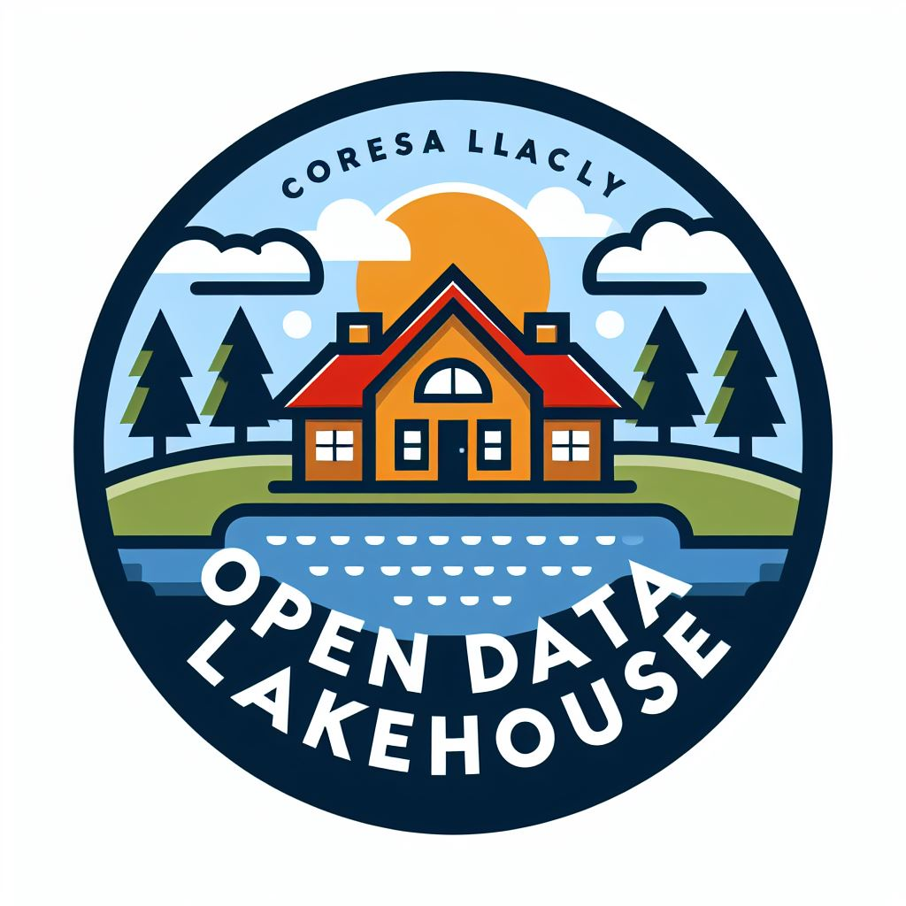
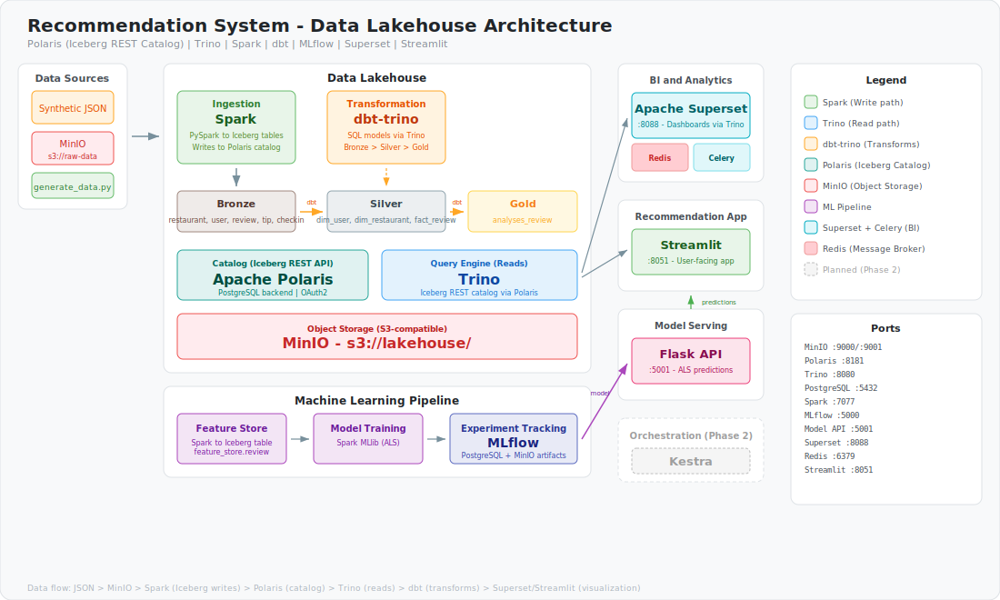
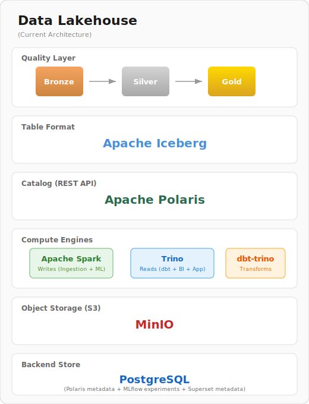

<h1 align="center">Data Lakehouse</h1>
<p align="center">
    
</p>
<p align="center">
    Open Data Lakehouse Platform — Restaurant Recommendation Engine built on modern open-source tools
</p>

<a name="table-of-contents"></a>
## Table of contents
-   [Table of contents](#table-of-contents)
-   [Description](#description)
-   [System Architecture](#system-architecture)
-   [Lakehouse Architecture](#lakehouse-architecture)
-   [Quick start](#quick-start)
    -   [Requirements](#requirements)
    -   [Installation](#installation)
    -   [Usage](#usage)
        -   [Access services](#access-services)
        -   [Prepare data](#prepare-data)
        -   [Orchestrate pipeline](#orchestrate-pipeline)
        -   [Query data](#query-data)
    -   [Clean up](#clean-up)
-   [Todo](#todo)


<a name="description"></a>
## Description
> **Note**: This project is a portfolio/learning POC for an open-source lakehouse platform.

End-to-end data lakehouse for restaurant recommendations using a **medallion architecture** (Bronze → Silver → Gold). The platform is built on the following components:

- [Apache Spark](https://spark.apache.org/) — Bronze ingestion (JSON → Iceberg) and ALS model training (PySpark MLlib)
- [Apache Iceberg](https://iceberg.apache.org/) — Open table format with ACID transactions, replacing Delta Lake
- [Unity Catalog OSS](https://github.com/unitycatalog/unitycatalog) — REST catalog for table metadata, replacing Hive Metastore
- [Trino](https://trino.io/) — Distributed query engine reading from Unity Catalog (Iceberg REST), replacing Spark Thrift Server
- [dbt (dbt-trino)](https://docs.getdbt.com/docs/core/connect-data-platform/trino-setup) — SQL transformations Bronze → Silver → Gold via Trino
- [MinIO](https://min.io/) — S3-compatible object storage (buckets: `lakehouse`, `mlflow`, `raw-data`)
- [MLflow](https://mlflow.org/) — ML experiment tracking and model registry
- [PostgreSQL](https://www.postgresql.org/) — Backend for MLflow, Unity Catalog, and Superset
- [Apache Superset](https://superset.apache.org/) — BI dashboards (with Celery worker + Redis)
- [Flask](https://flask.palletsprojects.com/) — Model serving API for ALS recommendations
- [Streamlit](https://streamlit.io/) — Frontend user interface


<a name="system-architecture"></a>
## System Architecture
The system architecture is shown in the following diagram:

<p align="center">
    
</p>

The platform uses a modern open-source stack: Spark for ingestion and ML training, Iceberg as the table format, Unity Catalog as the single source of truth for metadata, and Trino as the universal query engine for all read workloads (dbt transforms, Superset dashboards, Streamlit app).


<a name="lakehouse-architecture"></a>
## Lakehouse Architecture
The lakehouse architecture is shown in the following diagram:

<p align="center">
    
</p>

The medallion architecture has four layers:

- **Bronze** — Raw JSON data ingested from MinIO via Spark, written as Iceberg tables and registered in Unity Catalog
- **Silver** — Dimensional model (star schema: `dim_user`, `dim_restaurant`, `dim_date`, `fact_review`) built by dbt-trino
- **Gold** — Analytics-ready aggregates (e.g. `analyses_review`) built by dbt-trino
- **ML** — ALS collaborative filtering model trained on Silver data via PySpark MLlib, tracked in MLflow

**Catalog flow:**
```
Spark writes Iceberg → registers in Unity Catalog (REST API)
Trino → reads from Unity Catalog (REST catalog) → queries Iceberg tables
dbt-trino → sends SQL to Trino → transforms Bronze → Silver → Gold
Superset / Streamlit → query via Trino
```


<a name="quick-start"></a>
## Quick start

<a name="requirements"></a>
### Requirements
- [Docker](https://www.docker.com/) and Docker Compose

<a name="installation"></a>
### Installation
Clone the repository:
```bash
git clone https://github.com/dineshssdn-867/onprem-lakehouse.git
cd building-lakehouse
```

Copy and update environment variables:
```bash
cp .env.template .env
# Edit .env with your credentials
```

Start all services:
```bash
docker compose up -d
```

<a name="access-services"></a>
### Access services
| Service | URL | Purpose |
|---------|-----|---------|
| MinIO Console | http://localhost:9001 | Object storage UI |
| Unity Catalog | http://localhost:8080 | Data catalog REST API |
| Trino | https://localhost:8443 | Query engine |
| Spark Master | http://localhost:8090 | Spark UI |
| MLflow | http://localhost:5000 | Experiment tracking |
| Model Server | http://localhost:5001 | Flask recommendation API |
| Streamlit | http://localhost:8051 | Frontend app |
| Superset | http://localhost:8088 | BI dashboards |

<a name="prepare-data"></a>
### Prepare data
Upload raw JSON data to the `raw-data` bucket in MinIO, then run the Spark ingestion script to write Iceberg tables to the `lakehouse` bucket:
```bash
docker exec spark-master spark-submit /scripts/etl_bronze.py
```

<a name="orchestration-pipeline"></a>
### Orchestrate pipeline
Run dbt transformations via Trino to build Silver and Gold layers:
```bash
docker exec dbt dbt run --project-dir /dbt/restaurant_analytics
```

<a name="query-data"></a>
### Query data
Connect any SQL client or Superset to Trino at `localhost:8443` using the `iceberg` catalog. All Bronze/Silver/Gold tables are queryable via Unity Catalog.

<a name="cleanup"></a>
### Clean up
```bash
docker compose down
```
To also remove all volumes (data):
```bash
docker compose down -v
```

<a name="todo"></a>
## Todo
- [x] Migrate Delta Lake → Apache Iceberg
- [x] Migrate Hive Metastore → Unity Catalog OSS
- [x] Migrate Spark Thrift Server → Trino
- [x] Migrate dbt-spark → dbt-trino
- [x] Replace Metabase → Apache Superset
- [ ] Migrate Airflow → Kestra (Phase 2)
- [ ] Fix `restaurant_analytis` typo → `restaurant_analytics`
- [ ] Remove hardcoded credentials and IPs
- [ ] Add more dbt tests and documentation
